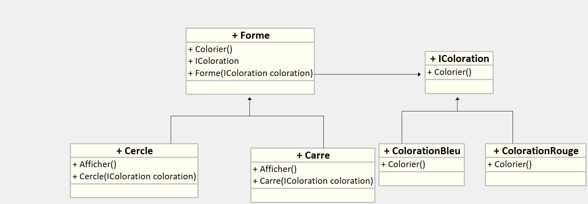

# Patrons de création :

## Pont

### Présentation

Le design pattern Bridge est un modèle structurel qui permet de séparer l'abstraction d'une classe de son implémentation, de sorte que les deux puissent évoluer indépendamment. 

### Avantages

Cela permet d'avoir des applications multiplateforme

Avec le principe ouvert / fermé, cela rend facile l'implémentation de nouvelles abstractions et implémentations indépendamment les unes des autres. 

Il est possible de se concentrer sur la logique de haut niveau dans l’abstraction, et sur les détails de la plateforme dans l’implémentation.

### Inconvénient

Cela rajoute une couche supplémentaire d'abstraction et le rend plus difficile à comprendre. Il est souvent plus utile sur les plus gros projets car sur des plus petits ce n'est pas forcément nécéssaire.

Cela peu rajouter beaucoup de classes et d'implémentation dans le code et demande alors une gestion plus complexe.

Avec l'implémentation de classes, cela rend plus difficile la maintenance de celles-ci où il peut être nécessaire de mettre à jour plusieurs classes en même temps.

Pour les développeurs qui ne sont pas familiers avec le pattern Bridge, son utilisation peut nécessiter un apprentissage initial. Il peut être perçu comme moins intuitif que des approches plus simples, ce qui peut entraîner une courbe d'apprentissage.

### Présentation UML



### Implémentation en C#

Dans ce contexte, on veux faire des carrés et des cercles qu'on  souhaite afficher avec différentes couleurs. Plutôt que de lier étroitement les formes aux couleurs, elles sont conçus indépendemment afin de pouvoir rajouter facilement de nouvelles classes (formes où couleurs). Ainsi il sera facile d'ajouter au besoin de nouvelles fonctionnalités avec moins d'implémentation et de classes.
```
public interface IColoration
{
    void Colorier();
}

public class ColorationRouge : IColoration
{
    public void Colorier()
    {
        Console.WriteLine("Coloration en Rouge");
    }
}

public class ColorationBleu : IColoration
{
    public void Colorier()
    {
        Console.WriteLine("Coloration en Bleu");
    }
}

public abstract class Forme
{
    protected IColoration Coloration;

    protected Forme(IColoration coloration)
    {
        Coloration = coloration;
    }

    public abstract void Afficher();
}

public class Cercle : Forme
{
    public Cercle(IColoration coloration) : base(coloration)
    {
    }

    public override void Afficher()
    {
        Console.Write("Cercle ");
        Coloration.Colorier();
    }
}

public class Carre : Forme
{
    public Carre(IColoration coloration) : base(coloration)
    {
    }

    public override void Afficher()
    {
        Console.Write("Carré ");
        Coloration.Colorier();
    }
}

class Program
{
    static void Main()
    {
        IColoration colorationRouge = new ColorationRouge();
        IColoration colorationBleu = new ColorationBleu();

        Forme cercle = new Cercle(colorationRouge);
        Forme carre = new Carre(colorationBleu);

        cercle.Afficher(); 
        carre.Afficher();
    }
}

```