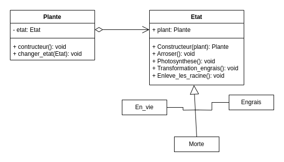
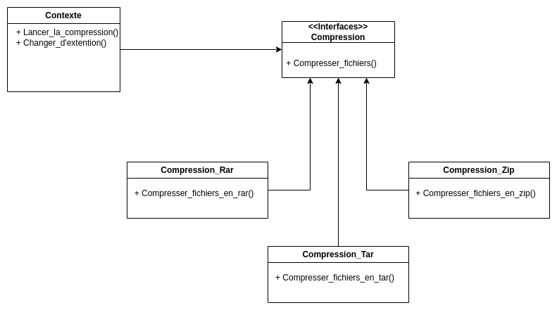

# Etat (State)

## Déscription

Le DP Etat, permet de travailler avec des état avec les objets.
Un objet a donc un état defini dans un objet.

## Avantage

- Principe de responsabilité unique
- Ajoutez de nouveaux états sans modifier les classes état ou le contexte existants.
- Simplifiez le code du contexte en éliminant les gros blocs conditionnels.

## Inconvénient

- Trop complexe pour des automate simple.

## UML



## Exemple C#

```cs

class Plante
    {
        private Etat etat;

        public Plante()
        {
            this.etat = new En_vie(this);
        }

        public void changer_etat(Etat etat)
        {
            this.etat = etat;
        }
    }

    abstract class Etat
    {
        public Plante plant;

        public Etat(Plante plant)
        {
            this.plant = plant;
        }

        public abstract void Arroser();//Lance la lecture de la video

        public abstract void Photosynthese();//Met la video en pause

        public abstract void Transformation_engrais();//Arrete la lecture de la video

        public abstract void Enleve_les_racine();

    }

    class En_vie : Etat
    {

        public En_vie(Plante plant): base(plant)
        {
           
        }

        public override void Arroser()
        {
            Console.WriteLine("Plante arrosé");//arrose la plante
        }

        public override void Photosynthese()
        {
            Console.WriteLine("photosynthese possible");//Fait de la photosynthese
        }

        public override void Enleve_les_racine()
        {
            plant.changer_etat(new Morte(plant)); //Change l'etat de la plante
        }

        public override void Transformation_engrais()
        {
            plant.changer_etat(new Engrais(plant));//Change l'etat de la plante
        }
    }

    class Morte : Etat
    {
        public Morte(Plante plant) : base(plant)
        {

        }

        public override void Arroser()
        {
            //Fonction impossible a faire dans l'etat actuel
        }

        public override void Photosynthese()
        {
            //Fonction impossible a faire dans l'etat actuel
        }

        public override void Transformation_engrais()
        {
            plant.changer_etat(new Engrais(plant));//Change l'etat de la plante
        }

        public override void Enleve_les_racine()
        {
            //Fonction impossible a faire dans l'etat actuel
        }
    }

    class Engrais : Etat
    {

        public Engrais(Plante plant) : base(plant)
        {

        }

        public override void Arroser()
        {
            //Fonction impossible a faire dans l'etat actuel
        }

        public override void Photosynthese()
        {
            //Fonction impossible a faire dans l'etat actuel
        }
        public override void Transformation_engrais()
        {
            //Fonction impossible a faire dans l'etat actuel
        }

        public override void Enleve_les_racine()
        {
            //Fonction impossible a faire dans l'etat actuel
        }
    }

```

# Observateur (Observer)

## Déscription

Le design patterns Observer, permet d'inscrire un objet à un autre objet pour qu'il reçoive une "notification" pour signaler un modification de l'objet.

## Avantage

- C'est facile d'ajouter de nouvelles classes souscripteur sans avoir à modifier le code du diffuseur.

## Inconvénient

- Les souscripteurs sont avertis dans un ordre aléatoire.

## UML

## Exemple C#
```CS
var jeanluc = new JeanLuc();
var marcel = new Marcel();

var sortieJurassikPark = new SortieJurassikPark();

sortieJurassikPark.Attach(jeanluc);
sortieJurassikPark.Attach(marcel);

sortieJurassikPark.Notify();

public interface IPersonne
{
    void Update(ISortieFilm sortieFilm);
}

public interface ISortieFilm
{
    void Attach(IPersonne personne);
    void Detach(IPersonne personne);
    
    void Notify();
}

public class SortieJurassikPark : ISortieFilm
{
    
    public int State { get; set; } = -0;
    
    private List<IPersonne> _observers = new();

    // The subscription management methods.
    public void Attach(IPersonne personne)
    {
        Console.WriteLine($"{personne.GetType()} est inscrit pour la date de sortie !");
        _observers.Add(personne);
    }

    public void Detach(IPersonne personne)
    {
        _observers.Remove(personne);
    }
    
    public void Notify()
    {
        Thread.Sleep(2000);
        Console.WriteLine("Jurassik Park est sorti dans tous les cinémas !");

        foreach (var observer in _observers)
        {
            observer.Update(this);
        }
    }
}

class JeanLuc : IPersonne
{
    public void Update(ISortieFilm sortieFilm)
    {
        Console.WriteLine("Jean-Luc : J'ai hâte de voir la scène avec la chèvre !");
    }
}

class Marcel : IPersonne
{
    public void Update(ISortieFilm sortieFilm)
    {
        Console.WriteLine("Marcel : Whopopo il était temps !");
    }
}
```

# Stratégie (Strategy)

## Déscription

Le design patterns Stratégie permet de définir une famille d’algorithmes, de les mettre dans des classes séparées et de rendre leurs objets interchangeables.

## Avantage

- On peut permuter l’algorithme utilisé à l’intérieur d’un objet à l’exécution.
- On peut séparer les détails de l’implémentation d’un algorithme et le code qui l’utilise.
- On peut ajouter de nouvelles stratégies sans avoir à modifier le contexte.

## Inconvénient

## UML



## Exemple C#

```cs
using System;

public class Program
{
    public interface Compression
    {
        void CompressFolder(string compressedArchiveFileName);
    }

    public class CompressionContext
    {
        private Compression Compression;

        public CompressionContext(Compression Compression)
        {
            this.Compression = Compression;
        }

        public void SetStrategy(Compression Compression)
        {
            this.Compression = Compression;
        }

        public void CreateArchive(string compressedArchiveFileName)
        {
            Compression.CompressFolder(compressedArchiveFileName);
        }
    }

    public class RarCompression : Compression
    {
        public void CompressFolder(string compressedArchiveFileName)
        {
            Console.WriteLine(
                "Le dossier est compresser en utilisant Rar '"
                    + compressedArchiveFileName
                    + ".rar' est créer"
            );
        }
    }

    public class TarCompression : Compression
    {
        public void CompressFolder(string compressedArchiveFileName)
        {
            Console.WriteLine(
                "Le dossier est compresser en utilisant Rar '"
                    + compressedArchiveFileName
                    + ".tar' est créer"
            );
        }
    }

    public class ZipCompression : Compression
    {
        public void CompressFolder(string compressedArchiveFileName)
        {
            Console.WriteLine(
                "Le dossier est compresser en utilisant Rar '"
                    + compressedArchiveFileName
                    + ".zip' est créer"
            );
        }
    }

    public static void Main()
    {
        ///On change la stratégie en zip
        CompressionContext ctx = new CompressionContext(new ZipCompression());
        ctx.CreateArchive("DotNetDesignPattern");
        // On change pour la stratégie en Rarr
        ctx.SetStrategy(new RarCompression());
        ctx.CreateArchive("DotNetDesignPattern");
        // On change pour la stratégie en Tar
        ctx.SetStrategy(new TarCompression());
        ctx.CreateArchive("DotNetDesignPattern");
        Console.Read();
    }
}
```
